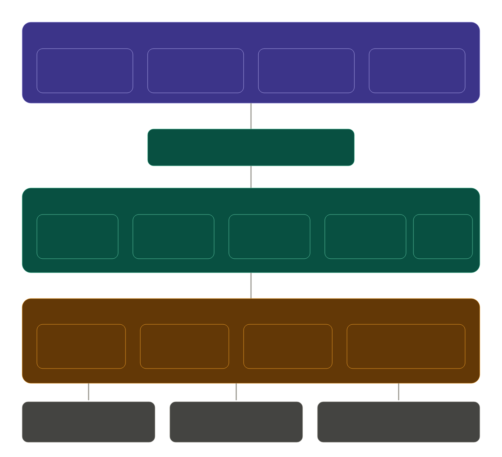

# Marketing CRM

A full-stack marketing automation platform for campaign management, audience segmentation, and engagement tracking.

## Tech Stack

- **Frontend:** React, Vite, Tailwind CSS, Recharts, React Router
- **Backend:** Node.js, Express.js
- **Database:** MongoDB Atlas (Mongoose)
- **Auth:** JWT (JSON Web Tokens)

## Features
### Authentication
- User Registration & Login
- Secure JWT-based authentication

### Campaign Management
- Create campaigns (Email, SMS, Push, Social Media)
- Budget tracking
- Scheduling & frequency control
- Campaign performance tracking (opens, clicks, conversions)

### Audience Segmentation
- Dynamic segment builder
- Custom filters (demographics, behavior)
- Segment size preview
- Export segment data

###  Contact Management
- Centralized contact database
- Custom fields support
- Unsubscribe handling

### Email Marketing
- Email template builder (HTML support)
- Responsive preview
- Pre-built templates

### Analytics Dashboard
- Campaign performance metrics
- Charts & visual insights
- Real-time tracking
  
```

## Project Structure

marketing-crm/
├── client/          # React frontend
│   └── src/
│       ├── pages/       # Dashboard, Contacts, Campaigns, etc.
│       ├── components/  # Layout, shared components
│       └── utils/       # API client, auth helpers
└── server/          # Express backend
    ├── models/      # Mongoose schemas
    ├── controllers/ # Business logic
    ├── routes/      # API routes
    └── middleware/  # Auth middleware

## Setup Instructions

### Prerequisites
- Node.js v18+
- MongoDB Atlas account

### Backend Setup

```bash
cd server
npm install
```

Create a `.env` file in the `server` folder (see `.env.example`):

PORT=5000
MONGO_URI=mongodb+srv://<user>:<pass>@cluster.mongodb.net/marketing-crm
JWT_SECRET=your_secret_key
EMAIL_HOST=smtp.gmail.com
EMAIL_PORT=587
EMAIL_USER=your@gmail.com
EMAIL_PASS=your_app_password
NODE_ENV=development


```bash
npm run dev
```

Server runs on `http://localhost:5000`

### Frontend Setup

```bash
cd client
npm install
npm run dev
```

Frontend runs on `http://localhost:5173`

## API Endpoints

| Method | Endpoint | Description |
|--------|----------|-------------|
| POST | /api/auth/register | Register user |
| POST | /api/auth/login | Login user |
| GET | /api/contacts | Get all contacts |
| POST | /api/contacts | Create contact |
| DELETE | /api/contacts/:id | Delete contact |
| PUT | /api/contacts/:id/unsubscribe | Unsubscribe contact |
| GET | /api/campaigns | Get all campaigns |
| POST | /api/campaigns | Create campaign |
| PUT | /api/campaigns/:id | Update campaign |
| DELETE | /api/campaigns/:id | Delete campaign |
| GET | /api/segments | Get all segments |
| POST | /api/segments | Create segment |
| POST | /api/segments/preview | Preview segment size |
| GET | /api/emails | Get email templates |
| POST | /api/emails | Create email template |
| GET | /api/analytics/dashboard | Get dashboard stats |

## Database Schema

- **users** - Auth credentials and profile
- **contacts** - Contact database with custom fields
- **segments** - Dynamic audience groups with filters
- **campaigns** - Campaign definitions and metrics
- **emailtemplates** - Reusable HTML email templates
- **analyticsevents** - Open/click/bounce tracking events

## ER Diagram



## Key Highlights

- Modular backend architecture
- Clean UI with responsive design
- Real-time analytics tracking
- Scalable structure for future enhancements
  
